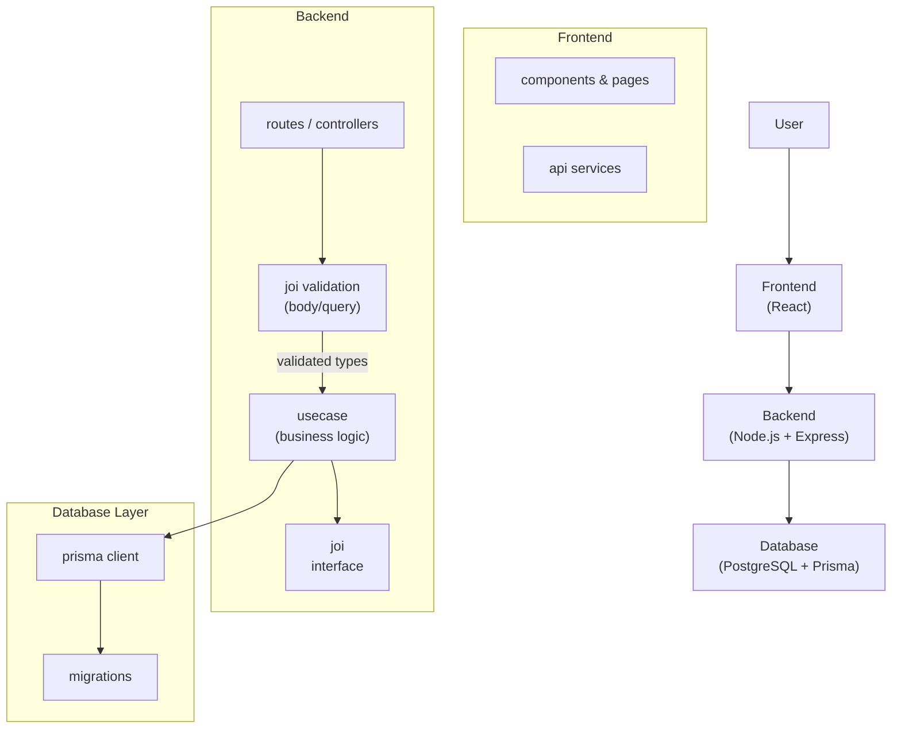

---

## 1. project title & tagline
**simple-todo-list** — A fullstack clean-architecture Todo app built with Node.js, Express, Prisma, PostgreSQL, and React.

---

## 2. preview / demo
- 🚀 Live Demo: *[coming soon](#)*  
- 🖼️ Screenshot:  
  <!--  -->

---

## 3. about / features
This project is a simple Todo application designed to demonstrate **clean architecture** in a fullstack environment.  

**core features:**
- create, update, and list todos  
- login & google auth
- clean architecture separation (domain, usecases, infrastructure, interfaces)  
- prisma migrations & PostgreSQL integration  
- modular frontend with React  
- ready for containerization with Docker  

---

## 4. tech stack
- **backend**: Node.js, Express, Prisma, PostgreSQL  
- **frontend**: React (Vite)  
- **infrastructure**: Docker

---

## 5. architecture overview


---

## 6. getting started
### prerequisites
- Node.js v18+  
- PostgreSQL  
- pnpm / npm  
- Docker (optional)  

### steps
```bash
# clone repo
git clone https://github.com/riorichard-portfolio/simple-todo-list.git
cd simple-todo-list

# install dependencies
npm install

# setup env
cp .env.example .env   # edit DATABASE_URL, etc.

# run migrations
npm prisma migrate dev

# run backend
make backend

# run frontend
make frontend
```

---

## 7. project structure
```
.
├── backend/
│   ├── prisma/
│   │   └── migrations
│   └── src/
│       ├── constants
│       ├── environment
│       ├── handler
│       ├── joi
│       ├── middleware
│       ├── models
│       ├── prisma
│       ├── routes
│       ├── types
│       ├── usecase
│       └── utils
└── frontend/
    ├── public
    └── src/
        ├── api
        ├── assets
        ├── components
        ├── context-provider
        ├── hooks
        ├── pages
        ├── routes
        └── utils
```

---

## 8. usage / api endpoints
```
POST /auth/login → login email & password
POST /auth/login/google → login google
POST /todo → create todo
GET /todo → list todo
GET /todo/categories → list todo categories
PATCH /todo → update todo
```